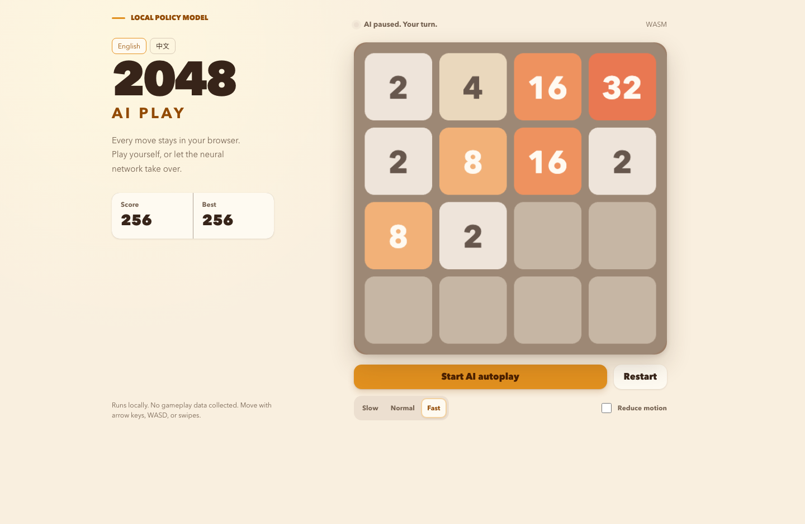
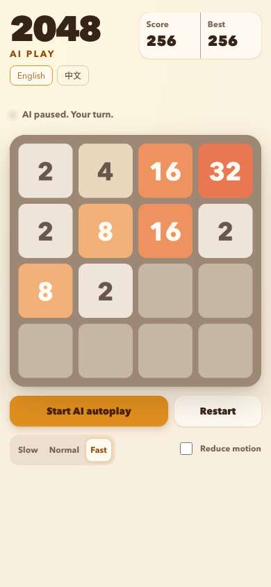

# 2048 AI

English | [简体中文](README.zh-CN.md)

A browser-only 2048 game with a PixiJS board and a neural policy trained in PyTorch. Play manually or let the AI take over the current board. ONNX Runtime Web runs inference locally; gameplay needs no backend and uploads no game data.

## Demo



<details>
<summary>Mobile view</summary>



</details>

Screenshots show the English interface after AI autoplay. Use the English / 中文 buttons to switch languages; your selection is remembered locally. English is the default.

## Features

- Arrow keys, WASD, and touch swipes.
- AI autoplay from the current board, with pause and three speed settings.
- Local session recovery and best-score persistence.
- WebGPU inference with a single-threaded WASM fallback.
- Responsive layout, reduced-motion support, and model SHA-256 validation.

## Quick start

Install Node.js 22 and npm 10, then run:

```bash
npm ci
npm run dev
```

Open the server URL, usually `http://localhost:5173/`. A trained model is included: Python and retraining are not required to play. The model loads asynchronously while manual play is available.

Use arrow keys, WASD, or swipes. Select **Start AI autoplay** to start the AI and **Pause AI autoplay** to resume manual control. Reaching 2048 does not end the game.

```bash
npm run build    # Production build
npm run preview  # Local production preview
```

## Published model results

The bundled model completed 1,000 fixed-seed games using the TypeScript engine and ONNX Runtime Web WASM.

| Metric                          | Result              |
| ------------------------------- | ------------------- |
| Games reaching 2048             | 737 / 1,000 (73.7%) |
| Median maximum tile             | 2048                |
| Median score                    | 32,438              |
| Median moves                    | 1,682               |
| Decision latency P95            | 19.45 ms            |
| Illegal moves / truncated games | 0 / 0               |
| Model size                      | About 4.6 MiB       |

Gameplay uses seeds 50,000–50,999. Latency is measured separately over five single-process games to avoid parallel CPU contention. Timing depends on the machine. See the [model manifest](public/models/policy.manifest.json) for recorded metrics and the model hash.

```bash
npm run benchmark:model -- --games 100
```

## Training and publication

Training requires Python 3.12 and [uv](https://docs.astral.sh/uv/). Full data generation also needs a C++ compiler for the native Expectimax teacher; on macOS, install Xcode Command Line Tools.

```bash
uv sync --directory training --all-groups
npm run train:smoke
```

The smoke command publishes a test model and can replace the bundled model manifest. It bypasses the full quality gate. Restore the tracked manifest after experimenting to use the bundled model again.

Run the full sequence in order:

```bash
npm run train:full
npm run train:dagger
npm run train:polish
npm run train:ensemble
```

Expectimax generates soft targets, with dataset splits grouped by complete game seed. A residual CNN learns with eight-way board augmentation. DAgger labels states visited by the student and retrains with weighted hard-state replay. Low-learning-rate polishing refines the checkpoint, then an ONNX ensemble averages eight rotated and reflected views.

The [full configuration](training/configs/full.json) uses 96 channels, six residual blocks, and two DAgger rounds. Datasets and intermediate artifacts are stored in `training/datasets/` and `training/artifacts/`, both ignored by Git.

Full stages retain candidates even when publication fails. A failed quality gate exits with an error; later stages can still use the saved checkpoints. Publication requires zero illegal moves, zero truncated games, at least 50% reaching 2048, median maximum tile at least 1024, and single-process decision P95 at most 50 ms. Passing candidates are published atomically with content-hashed filenames.

## Model contract and project structure

Input: one-hot `float32[1,16,4,4]` board. Output: `float32[1,4]` logits ordered `[up, right, down, left]`. The browser masks illegal moves and selects the highest remaining logit. Model errors pause autoplay while manual play remains available.

| Directory        | Responsibility                                              |
| ---------------- | ----------------------------------------------------------- |
| `src/game/`      | Authoritative rules, deterministic randomness, game control |
| `src/ai/`        | Board encoding, legal-move selection, browser inference     |
| `src/render/`    | PixiJS rendering and animation                              |
| `training/`      | Teacher, datasets, training, ONNX export                    |
| `public/models/` | Published model and manifest                                |
| `tests/e2e/`     | Desktop and mobile browser tests                            |
| `docs/adr/`      | Architecture decisions                                      |

## Verification

Install Python development dependencies and the test browser before running the full suite:

```bash
uv sync --directory training --all-groups
npx playwright install chromium
npm run check:all
```

Individual commands:

```bash
npm run check         # Formatting, lint, TypeScript, frontend tests
npm run check:python  # Python formatting, lint, types, tests
npm run build         # Production build
npm run test:e2e      # Desktop and mobile browser tests
```

Tests cover deterministic replay, merge rules, shared Python/TypeScript fixtures, persistence, AI handoff, model failures, teacher labels, and ONNX export parity.
